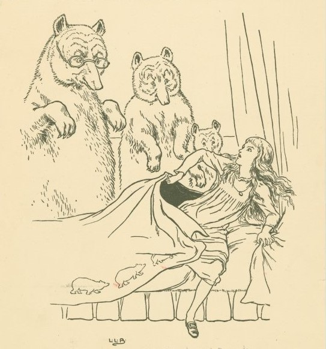

<script src="https://ajax.googleapis.com/ajax/libs/jquery/1.12.2/jquery.min.js"></script>

<script>
    $(document).ready(function() {
      $('slide:not(.title-slide, .backdrop, .segue)').append('<footer label=\"Nicola Rennie\"></footer>');    
    })
</script>

<style>
  footer:after {
    content: attr(label);
    font-size: 12pt;
    position: absolute;
    bottom: 20px;
    left: 120px;
    line-height: 1.9;
  }
  
  pre code {
   display: block; padding: 0.5em;
   word-wrap: break-word;
   white-space: pre-wrap;
  }
</style>

<style type="text/css">
slides > slide:not(.nobackground):after {
  content: '';
}
</style>

```{r, echo=FALSE}
knitr::opts_chunk$set(fig.align = "center")
```

# About me

---

* PhD Statistics and Operational Research

* Data scientist at Jumping Rivers
  * Consultancy: shiny, statistics, slides, ...
  * Internal projects: blogdown websites, reports, plot styling, admin, ...
  * Training: all things R (and some Tableau coming soon...)
  
* A lot of data visualisation...

## My R Journey

* Compulsory R coursework for a statistics course during undergraduate degree
* Learnt Python instead...
* Final year of undergrad gave R another go
* Started learning {tidyverse} during PhD

## Why data visualisation?

```{r, echo=FALSE, warning=FALSE, message=FALSE}
library(ggforce)
circles <- data.frame(
  x0 = c(0, 1),
  y0 = c(0, 0),
  r = c(1, 1), 
  fill = c("#6a359c", "#8cd3ff")
)
text_df <- data.frame(x = c(-0.3, 0.5, 1.3), 
                      y = c(0, 0, 0), 
                      label = c("Maths", "Data\nVisualisation", "Art"))
ggplot() +
  geom_circle(data = circles, 
              mapping = aes(x0 = x0, y0 = y0, r = r, fill = I(fill)), 
              alpha = 0.5, colour = "transparent") +
  geom_text(data = text_df,
            mapping = aes(x = x, y = y, label = label), 
            size = 6, 
            fontface = "italic") +
  coord_fixed() +
  theme_void() +
  theme(legend.position = "none")
```

# #30DayChartChallenge

Part 1

## What is the #30DayChartChallenge?

* Data visualisation challenge where participants make one chart each day inspired by a daily prompt and category.
* Organised by [Cédric Scherer](https://twitter.com/CedScherer) and [Dominic Royé](https://twitter.com/dr_xeo), with support from [Wendy Shijia](https://twitter.com/ShijiaWendy) and [Marco Sciaini](https://twitter.com/shinysci).
* Post charts on Twitter with the #30DayChartChallenge (and #DayX)
* See also: [30daychartchallenge.org](https://30daychartchallenge.org/)

## Prompts

<p align="center">

</p>

## Why did I make 30 charts?

* One "new tool" for each of the five categories
* Learn some new things
* Make charts that I wanted to make
* Have fun!

## How did I make 30 Charts?

```{r, echo = FALSE}
library(ggplot2)
library(rcartocolor)
plots = data.frame(lang = c("R", "Python", "Tableau", "Figma", "Inkscape", "RAWgraphs"), 
                   n = c(25, 1, 1, 1, 2, 1))
ggplot(plots, aes(x = lang, y = n, fill = lang)) +
  geom_col() +
  labs(x = "", 
       y = "Number of charts") +
  scale_fill_carto_d("Prism") +
  theme_minimal() +
  theme(legend.position = "none", 
        axis.title.y = element_text(margin = margin(r = 10)))
```

# The 30 Charts

---

<p align="center">

</p>

## Day 1 (Part to whole) in R
<p align="center">

</p>

## Day 2 (Pictogram) in R
<p align="center">

</p>

## Day 3 (Historical) in R
<p align="center">

</p>

## Day 4 (Flora) in Tableau (left) and R (right)
<p align="center">


</p> 

## Day 5 (Slope) in R
<p align="center">

</p>

## Day 6 (Our World in Data) in R
<p align="center">

</p>

## Day 7 (Physical) in R
<p align="center">

</p>

## Day 8 (Mountains) in Figma
<p align="center">

</p>

## Day 9 (Statistics) in R
<p align="center">

</p>

## Day 10 (Experimental) in R
<p align="center">

</p>

## Day 11 (Circular) in R
<p align="center">

</p>

## Day 12 (The Economist) in R
<p align="center">

</p>

## Day 13 (Correlation) in R
<p align="center">

</p>

## Day 14 (3-Dimensional) in Python and R
<p align="center">

</p>

## Day 15 (Multivariate) in R
<p align="center">

</p>

## Day 16 (Environment) in R
<p align="center">

</p>

## Day 17 (Connections) in R
<p align="center">

</p>

## Day 18 (OECD) in R
<p align="center">

</p>

## Day 19 (Global Change) in R
<p align="center">

</p>

## Day 20 (New Tool) in Inkscape
<p align="center">

</p>

## Day 21 (Down and Upwards) in R
<p align="center">

</p>

## Day 22 (Animation) in R
<p align="center">

</p>

## Day 23 (Tiles) in R
<p align="center">

</p>

## Day 24 (Financial Times) in R
<p align="center">

</p>

## Day 25 (Trend) in R
<p align="center">

</p>

## Day 26 (Interactive) in R
<p align="center">

</p>

## Day 27 (Future) in R 
<p align="center">

</p>

## Day 28 (Deviations) in RAWgraphs and Inkscape
<p align="center">

</p>

## Day 29 (Storytelling) in R and Inkscape
<p align="center">

</p>

## Day 30 (UN Population) in R
<p align="center">

</p>

# Lessons Learned

## What did I learn?

* R packages
  * `facet_zoom()` from {ggforce}
  * Quarto
  * {tidytext}
* Non-R tools can be very helpful...
* Repeating styles should be bundled into an R package


## What did I find difficult?

* Time
  * Didn't make charts each day, took breaks, reuse data
* Fitting my ideas and things I wanted to try to fit prompts
  * More planning


# The Goldilocks Decision Tree

Part 2

--- 

<p align="center">

</p>

## Flow charts in R

* {grid}
* {DiagrammeR}
* {igraph}
* {ggnetwork} / {ggnet2} / {ggraph}
* {tikz} (LaTeX)
* others...

Let's try to make a flowchart with {ggplot2}...

## R Packages

```{r, warning=FALSE, message=FALSE}
library(tidyverse)
library(igraph)
library(showtext)
library(rcartocolor)
```

## Data

```{r}
goldilocks <- tibble(from = c("Goldilocks",
                              "Porridge", "Porridge", "Porridge",
                              "Just right",
                              "Chairs", "Chairs", "Chairs",
                              "Just right2",
                              "Beds", "Beds", "Beds",
                              "Just right3"),
                     to = c("Porridge",
                            "Too cold", "Too hot", "Just right",
                            "Chairs",
                            "Still too big", "Too big", "Just right2",
                            "Beds",
                            "Too soft", "Too hard", "Just right3",
                            "Bears!"))
```

---

```{r, echo=FALSE}
head(goldilocks)
```

## Defining the layout

```{r}
g = graph_from_data_frame(goldilocks, directed = TRUE)
coords = layout_as_tree(g)
colnames(coords) = c("x", "y")
```

```{r, echo=FALSE}
head(coords)
```
## Adding attributes

```{r}
output_df = as_tibble(coords) %>%
  mutate(step = vertex_attr(g, "name"),
         x = x*-1,
         type = factor(c(1, 2, 3, 2, 3, 2, 3, 3, 3, 3, 3, 3, 3, 1)),
         label = gsub("\\d+$", "", step))
```

```{r, echo=FALSE}
head(output_df)
```
## Making the boxes

```{r}
plot_nodes = output_df %>%
  mutate(xmin = x - 0.35,
         xmax = x + 0.35,
         ymin = y - 0.25,
         ymax = y + 0.25)
```

```{r, echo=FALSE}
head(plot_nodes)
```

## Making the edges

```{r}
plot_edges = goldilocks %>%
  mutate(id = row_number()) %>%
  pivot_longer(cols = c("from", "to"),
               names_to = "s_e",
               values_to = "step") %>%
  left_join(plot_nodes, by = "step") %>%
  select(-c(label, type, y, xmin, xmax)) %>%
  mutate(y = ifelse(s_e == "from", ymin, ymax)) %>%
  select(-c(ymin, ymax))
```

```{r, echo=FALSE}
head(plot_edges, 3)
```

## Choosing fonts

* Google fonts and the {showtext} package
* Browse fonts: [fonts.google.com](https://fonts.google.com/)

```{r}
library(showtext)
font_add_google(name = "Henny Penny", family = "henny")
showtext_auto()
```

## Plotting (finally!)

```{r}
p = ggplot() +
  # draw rectangles
  geom_rect(data = plot_nodes,
            mapping = aes(xmin = xmin, ymin = ymin, xmax = xmax, ymax = ymax, 
                          fill = type, colour = type),
            alpha = 0.5,
            linejoin = "round") +
  # add text labels
  geom_text(data = plot_nodes,
            mapping = aes(x = x, y = y, label = label),
            family = "henny",
            color = "#585c45") +
  # add arrows
  geom_path(data = plot_edges,
            mapping = aes(x = x, y = y, group = id),
            colour = "#585c45",
            arrow = arrow(length = unit(0.3, "cm"), type = "closed"))
```

---

```{r}
p
```

## Colour schemes

* {rcartocolor}: [jakubnowosad.com/rcartocolor](https://jakubnowosad.com/rcartocolor/)

```{r}
p = p + 
  scale_fill_carto_d(palette = "Antique") +
  scale_colour_carto_d(palette = "Antique")
```

---

```{r}
p
```

## Some text labels

```{r, echo=F}
p = p + 
  labs(title = "The Goldilocks Decision Tree",
       caption = "N. Rennie\n\nData: Robert Southey. Goldilocks and the Three Bears. 1837.\n\nImage: New York Public Library\n\n#30DayChartChallenge") 
```

```{r, eval=F}
p = p + 
  labs(title = "The Goldilocks Decision Tree",
       caption = "N. Rennie\n\nData: Robert Southey. Goldilocks and the Three Bears. 
       1837.\n\nImage: New York Public Library\n\n#30DayChartChallenge") 
```

---

```{r}
p
```

## Background colours

* Choose image 
* Extract hex colour: [imagecolorpicker.com](https://imagecolorpicker.com/en)

<p align="center">

</p>

## Themes

```{r}
p = p + 
  theme_void() +
  theme(plot.margin = unit(c(1, 1, 0.5, 1), "cm"),
        legend.position = "none",
        plot.background = element_rect(colour = "#f2e4c1", fill = "#f2e4c1"),
        panel.background = element_rect(colour = "#f2e4c1", fill = "#f2e4c1"),
        plot.title = element_text(family = "henny", hjust = 0, face = "bold",
                                  size = 40, color = "#585c45",
                                  margin = margin(t = 10, r = 0, b = 10, l = 0)),
        plot.caption = element_text(family = "henny", hjust = 0,
                                    size = 10, color = "#585c45",
                                    margin = margin(t = 10)))
```

---

```{r}
p
```

## Adding images

* {magick} and {cowplot}
* Inkscape: [inkscape.org](https://inkscape.org/release/inkscape-1.2/)

---

<p align="center">

</p>


# Questions?

* Twitter: [@nrennie35](https://twitter.com/nrennie35)
* GitHub: [github.com/nrennie](https://github.com/nrennie)
* Website: [nrennie.rbind.io](https://nrennie.rbind.io/)
* Slides: [nrennie.rbind.io/talks/2022-may-rladies-nairobi/](https://nrennie.rbind.io/talks/2022-may-rladies-nairobi/)

