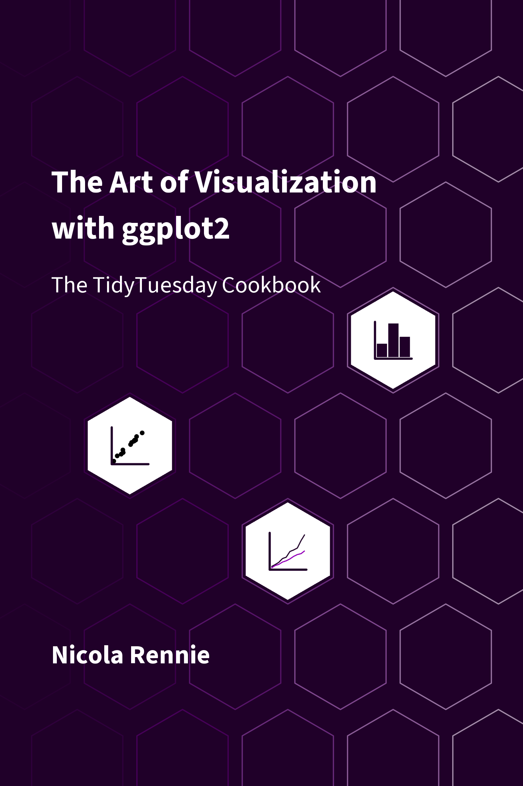
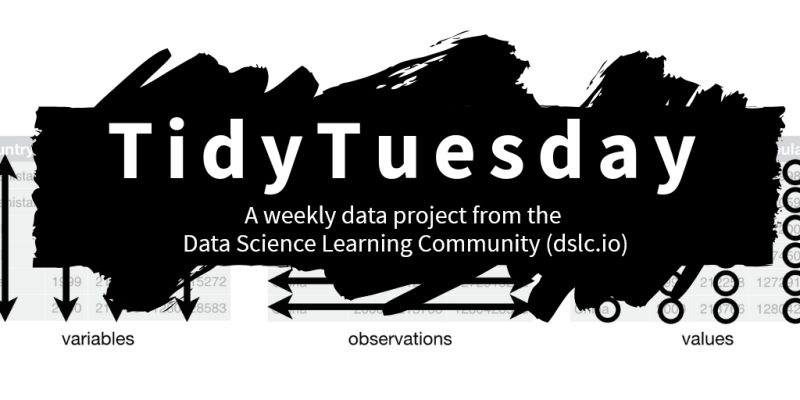
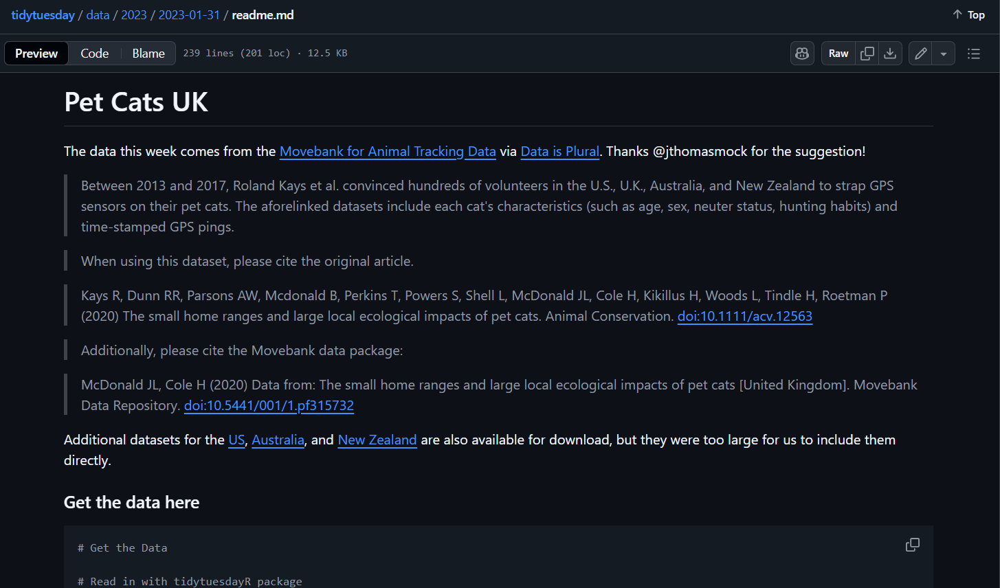
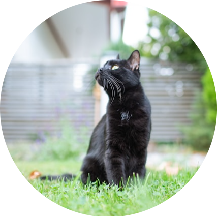
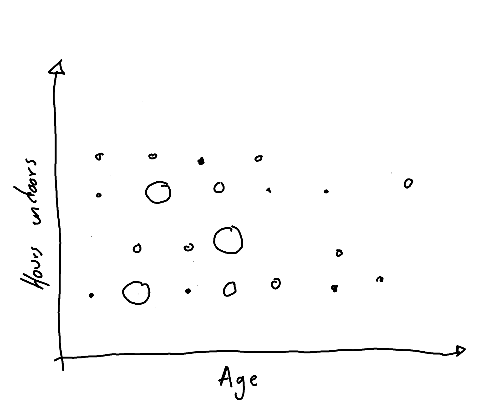
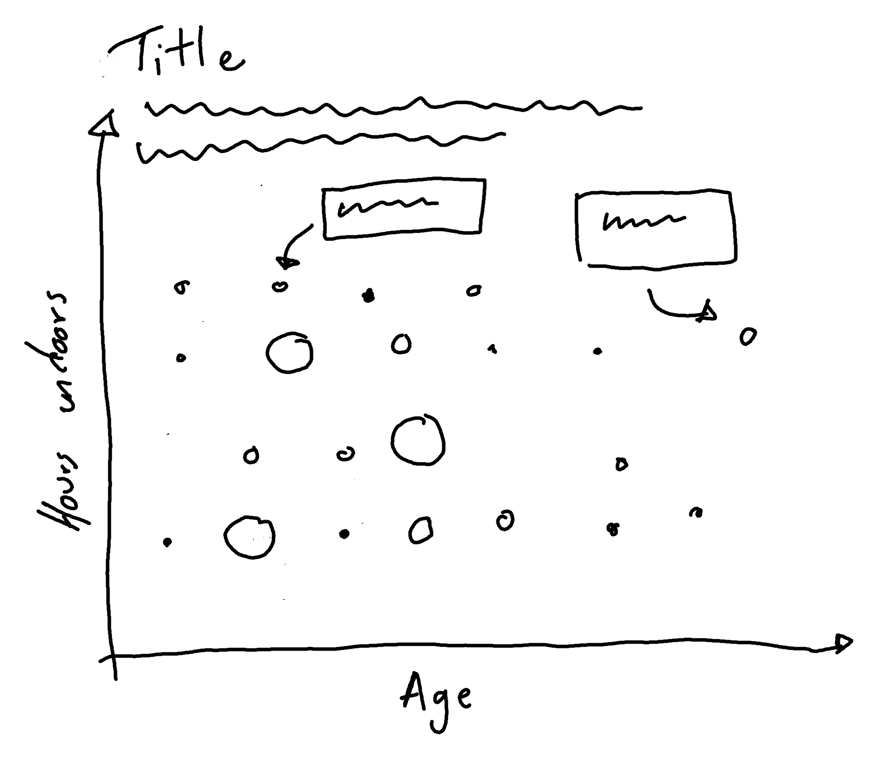
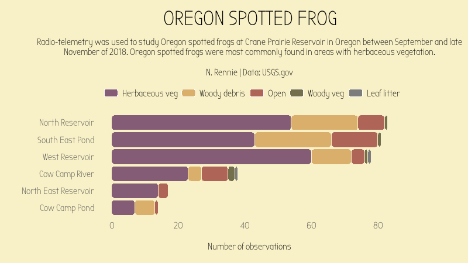
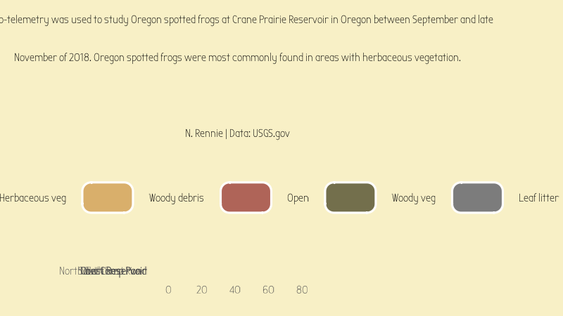

## About me

::: columns
::: {.column width="60%"}

Data visualisation specialist, mainly using R, Python, and D3.

<br>

Background in statistics, operational research, and data science.

<br>

Developer of several R packages, mainly for visualisation.

<br>

Author of *The Art of Visualization with ggplot2*.

:::

::: {.column width="40%"}

{fig-align="center" fig-alt="Cover of The Art of Visualization with ggplot2" width=75%}

:::

:::

## What's this session about?

* 

## TidyTuesday

::: columns

::: {.column}

* New data every week
* GitHub link

:::

::: {.column}

{width="100%" fig-align="center" fig-alt="TidyTuesday logo"}

:::

:::

## Packages

```{r}
#| code-fold: false
library(camcorder)
library(dplyr)
library(ggplot2)
library(ggtext)
library(glue)
library(showtext)
library(tidyr)
library(tidytuesdayR)
```

<br>

> Session will be demonstrated in RStudio.

# Data {background-color="#003c57" background-image="images/bg.png"} 

## TidyTuesday repository

::: columns

::: {.column}

Each week you can access the data (and a README file) on GitHub.

We'll be using a [dataset from 2023](https://github.com/rfordatascience/tidytuesday/blob/main/data/2023/2023-01-31/readme.md) for these examples.

:::

::: {.column}

{width="100%" fig-align="center" fig-alt="TidyTuesday repository screenshot"}

:::

:::


## Live demo

Load data using the `tidytuesdayR` package

```{r}
#| eval: false
tuesdata <- tt_load("2023-01-31")
cats <- tuesdata$cats_uk
cats_reference <- tuesdata$cats_uk_reference
```

```{r}
#| echo: false
#| eval: true
cats <- readr::read_csv("data/cats_uk.csv")
cats_reference <- readr::read_csv("data/cats_uk_reference.csv")
```

# Exploratory work {background-color="#003c57" background-image="images/bg.png"} 

## What question are we trying to answer?

::: columns

::: {.column}

* Where do cats go?
* How fast do cats run?
* How long do they spend indoors?
* Does that change as they get older?

:::

::: {.column}

{width="80%" fig-align="center" fig-alt="Photo of a black cat looking up off camera"}

:::

:::

## Live demo {.scrollable}

Where do cats go?

```{r}
#| eval: false
plot(
  x = cats$location_long,
  y = cats$location_lat,
  xlab = "Longitude",
  ylab = "Latitude"
)
```

How fast do cats run?

```{r}
#| eval: false
hist(
  x = cats$ground_speed,
  xlab = "Ground speed (m/s)",
  main = "Histogram of ground speed"
)
```

How long do they spend indoors?

```{r}
#| eval: false
barplot(table(cats_reference$hrs_indoors))
```

Does that change as they get older?

```{r}
#| eval: false
plot(
  x = cats_reference$age_years,
  y = cats_reference$hrs_indoors,
  xlab = "Age",
  ylab = "Hours indoors"
)
```

## Do older cats spend more time indoors? {.scrollable}

```{r}
#| fig-align: center
#| fig-height: 6
#| fig-asp: 0.67
#| echo: false
plot(
  x = cats_reference$age_years,
  y = cats_reference$hrs_indoors,
  xlab = "Age",
  ylab = "Hours indoors"
)
```

## Sketching ideas

Don't jump straight into writing code for the *final* chart yet!

* Sketching is an important part of the design process.
* Explore visualizations (in the same way you explore the data before you decide how to process it).
* Refine your design ideas. 
* Throw it away if it doesn’t work.

## Initial sketch

{width="55%" fig-align="center" fig-alt="Initial sketch of chart"}

## Add some detail to the sketch

{width="55%" fig-align="center" fig-alt="Sketch of chart"}

# Preparing a plot {background-color="#003c57" background-image="images/bg.png"} 

## What data do we need?

* The number of cats in each unique combination of `hrs_indoors` and `age_years`.

* We only need to use the `cats_reference` data.

* Is all of the data in the format that we expect?

## Live demo {.scrollable}

Data wrangling

```{r}
plot_data <- cats_reference |>
  select(age_years, hrs_indoors) |>
  mutate(hrs_indoors = factor(hrs_indoors)) |>
  count(age_years, hrs_indoors) |>
  drop_na()
```

Initial draft of a plot

```{r}
#| output-location: slide
#| fig-align: center
#| fig-height: 6
#| fig-asp: 0.67
basic_plot <- ggplot(
  data = plot_data,
  mapping = aes(
    x = age_years,
    y = hrs_indoors,
    size = n
  )
) +
  geom_point()
basic_plot
```

## Before we go any further!

Have you ever spent ages tinkering with a plot you’re previewing in RStudio...

{width="65%" fig-align="center" fig-alt="Stacked bar chart"}

## Before we go any further!

...and then used `ggsave()` to save an image, and ended up with something like this:

{width="65%" fig-align="center" fig-alt="Stacked bar chart not looking very nice"}

## Why does this happen?

* This happens because we preview the chart at 96dpi (low resolution) in RStudio, but save the chart at 300dpi (high resolution) using the defaults for `ggsave()`.

* We could set `ggsave(dpi = 96)` but we usually don't want to save a low resolution image.

* Instead we want to preview the chart in RStudio at the higher resolution we'll be saving it at.

## How do we fix this?

* camcorder
* ggview

## Live demo 

Set up `camcorder`

```{r}
#| eval: false
library(camcorder)
gg_record(
  width = 6,
  height = 4
)
```

# Advanced styling {background-color="#003c57" background-image="images/bg.png"} 

## What do we want to change about this plot?

```{r}
#| echo: false
#| fig-align: center
#| fig-height: 6
#| fig-asp: 0.67
basic_plot
```

## Colours

Resources for choosing colours
Colours as variables


## Live demo {.scrollable}

Create variable for colours

```{r}
text_col <- "#152826"
highlight_col <- "#914D76"
bg_col <- "white"
```

Update basic chart

```{r}
basic_plot <- ggplot(
  data = plot_data,
  mapping = aes(
    x = age_years,
    y = hrs_indoors,
    size = n
  )
) +
  geom_point(color = highlight_col) +
  scale_size(breaks = c(3, 6, 9))
```

## Fonts

* packages for fonts
* local fonts -> ragg
* google fonts browse

Save as variables

## Live demo

Loading fonts

```{r}
font_add_google(name = "Chewy")
font_add_google(name = "Ubuntu")
showtext_auto()
showtext_opts(dpi = 300)
title_font <- "Chewy"
body_font <- "Ubuntu"
```

## Data-driven annotations

glue

## Live demo {.scrollable}

Making data-driven text with `glue()`

```{r}
annot_oldest <- cats_reference |>
  slice_max(age_years) |> 
  mutate(label = glue("The oldest cat is {animal_id} who is {age_years} years old.")) |> 
  select(hrs_indoors, age_years, label)
```

Adding annotation to chart

```{r}
annotated_plot <- basic_plot +
  geom_textbox(
    data = annot_oldest,
    mapping = aes(
      x = age_years - 2.5,
      y = factor(hrs_indoors),
      label = label
    ),
    halign = 0.5,
    hjust = 0.5,
    size = 2.5,
    lineheight = 0.5,
    family = body_font,
    box.color = text_col,
    color = text_col,
    maxwidth = unit(1, "in")
  )
```

## Additional text

narrative or questions

## Live demo

Create text variables

```{r}
title <- "Do older cats spend more time indoors?"
perc_indoor <- round(100 * sum(cats_reference$hrs_indoors == "22.5") / nrow(cats_reference))
st <- glue("Around {perc_indoor}% of cats in the study spend on average 22.5 hours per day indoors! There is a slight trend for cats to spend more time indoors as they age.")
cap <- "Data: McDonald JL, Cole H. 2020 | Graphic: Nicola Rennie"
```

Add text to chart

```{r}
text_plot <- annotated_plot +
  labs(
    title = title,
    subtitle = st,
    caption = cap,
    x = "Age of cat (years)",
    y = "Average time spent indoors (hours per day)",
    size = "Number of cats"
  )
```

## Final adjustments

* What about the fonts we chose?
* Where's the subtitle text gone?!
* The legend takes up a lot of space

## Live demo {.scrollable}

Apply default font and size

```{r}
theme_plot1 <- text_plot +
  theme_minimal(
    base_family = body_font,
    base_size = 10
  )
```

Further styling

```{r}
theme_plot2 <- theme_plot1 +
  theme(
    # legend styling
    legend.position = "inside",
    legend.position.inside = c(0.9, 0.25),
    legend.background = element_rect(fill = alpha(bg_col, 0.6), color = text_col),
    # text
    text = element_text(color = text_col),
    plot.title = element_text(family = title_font, face = "bold", size = rel(1.5)),
    plot.subtitle = element_textbox_simple(),
    plot.caption = element_textbox_simple(),
    plot.title.position = "plot",
    plot.caption.position = "plot",
    # background and grid
    panel.grid.minor = element_blank(),
    plot.background = element_rect(fill = bg_col, color = bg_col)
  )
```

Save as an image

```{r}
#| eval: false
ggsave(
  theme_plot2,
  filename = "cats.png",
  width = 6,
  height = 4
)
```

# Reflection {background-color="#003c57" background-image="images/bg.png"} 

## Reflection

```{r}
#| echo: false
#| fig-align: center
#| fig-height: 6
#| fig-asp: 0.67
theme_plot2
```

## Reflection 

* legend box and the annotation box currently look quite different. The legend box has square corners, compared to rounded corners, and the outline color is darker. For consistency, it would look better if both boxes appear with the same styling.

* If we had joined the GPS data, we could have perhaps made a more informative plot showing the relationship between age and activity level.Indoor != resting

## Want to keep going?

* Add more annotations and arrows pointing to the relevant data point.

* Join the `cats` and the `cats_reference` datasets using the `tag_id` column.

* Instead of plotting the time spent indoors on the y-axis, plot the cat’s average ground speed (ignoring that the values are very unusual!)

* Add another annotation that highlights the cat with the highest average speed.

## Tips for developing skills

* Just make charts
* Learn through play
* Learn in public
sahre code ideas, look at what other people make with the same data

## Resources

* **Slides**: [nrennie.rbind.io/talks/rladies-rome-ggplot2](https://nrennie.rbind.io/talks/rladies-rome-ggplot2/)

* **`ggplot2` documentation**: [ggplot2.tidyverse.org](https://ggplot2.tidyverse.org/)

* **`ggplot2` extension gallery**: [exts.ggplot2.tidyverse.org/gallery](https://exts.ggplot2.tidyverse.org/gallery/)

* **R Graphics Cookbook**: [r-graphics.org](https://r-graphics.org/)

# Read the book: [nrennie.rbind.io/art-of-viz](https://nrennie.rbind.io/art-of-viz/) {background-color="#003c57" background-image="images/bg.png"} 

Questions?
